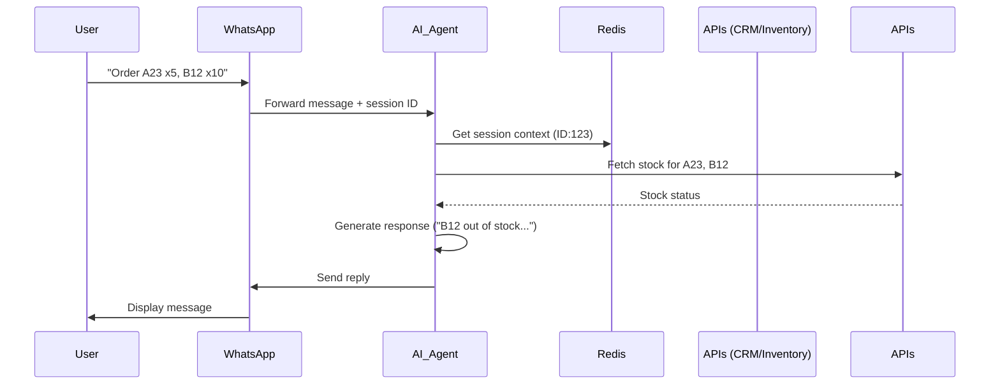

To create an AI agent that functions as a sophisticated WhatsApp chatbot with the capabilities you've described, follow this structured approach:

---

### **1. Core Architecture**
- **Tech Stack**:
  - **LLM Backbone**: Use fine-tuned models like **GPT-4**, **Llama 3**, or **Mistral** for conversational intelligence.
  - **Backend Framework**: Python with **FastAPI**/Flask for APIs.
  - **Session Management**: **Redis** for real-time conversation history tracking.
  - **WhatsApp Integration**: Use **Twilio API for WhatsApp** or **WhatsApp Business API**.
  - **File Parsing**: **Pandas** for .xlsx/.csv extraction.
  - **APIs**: RESTful services for inventory/CRM integration.

---

### **2. Key Components & Implementation**

#### **A. Conversational Intelligence**
- **Fine-Tuning**:
  - Train the LLM on historical chat logs using **LoRA** (Low-Rank Adaptation) to adopt company tone/lingo.
  - Tools: **Hugging Face Transformers** + **RLHF** (Reinforcement Learning from Human Feedback).
- **Context Handling**:
  - Maintain session-specific context in Redis with a TTL (e.g., 30 mins inactivity expiry).
  - Use **LLM prompt engineering** for ambiguity resolution:
    ```python
    prompt = f"""
    [System] You're a sales agent. Current order context: {redis.get(session_id)}.
    User query: "{message}". If ambiguous, ask ONE clarifying question.
    """
    ```

#### **B. Product/Stock Verification**
- **SKU Extraction**:
  - **Text Messages**: Use regex + spaCy NER:
    ```python
    pattern = r"(\w+)\s+(\d+)\s*(karton|pcs|unit)"
    skus = re.findall(pattern, message)
    ```
  - **File Uploads**:
    ```python
    import pandas as pd
    if file_type == "csv":
        df = pd.read_csv(file_path, usecols=["SKU", "Qty"])
    # Similarly for .xlsx
    ```
- **Real-Time Stock Check**:
  - Call Inventory API (e.g., `GET /inventory?sku=A23`).
  - Logic for substitutions:
    ```python
    if stock_quantity < requested_qty:
        response = f"{sku} only has {stock_quantity} left. Adjust to {stock_quantity} or remove?"
    ```

#### **C. Discount Management**
- **CRM Integration**:
  - On session start, fetch customer tier via WhatsApp number:
    ```python
    customer_data = requests.get(f"{CRM_API}/customer?phone={wa_number}")
    discount = customer_data["tier_discount"]
    ```
- **Dynamic Pricing**:
  - Apply discounts in order summary:
    ```python
    total = (unit_price * qty) * (1 - discount)
    ```

#### **D. Order Creation & Invoicing**
- **Order Finalization**:
  - On confirmation, call Catalog API:
    ```python
    order_payload = {
        "items": [{"sku": "A23", "qty": 5}],
        "discount_tier": "GOLD",
        "customer_id": "WA123456"
    }
    response = requests.post(f"{CATALOG_API}/orders", json=order_payload)
    invoice_url = response.json()["invoice_url"]
    ```
- **Invoice Delivery**:
  - Send PDF/link via WhatsApp using **Twilio Media Messages**:
    ```python
    twilio_client.messages.create(
        media_url=[invoice_url],
        from_='whatsapp:+14155238886',
        to=f'whatsapp:{wa_number}'
    )
    ```

#### **E. Human Handoff**
- **Escalation Rules**:
  - Use **LLM intent detection** + keywords:
    ```python
    if "admin" in message or llm_classify(message) == "COMPLEX_ISSUE":
        send_to_human(session_id)  # Triggers internal alert
        return "An admin will contact you shortly."
    ```

---

### **3. Workflow Diagram**


---

### **4. Tools & Services**
| **Function**         | **Recommended Tools**                          |
|----------------------|-----------------------------------------------|
| LLM Hosting          | OpenAI API, Replicate, Hugging Face Inference |
| Session Storage      | Redis, Firebase Realtime DB                   |
| WhatsApp Gateway     | Twilio, MessageBird, Vonage                  |
| File Parsing         | Pandas, OpenPyXL (Excel)                      |
| Inventory/CRM        | Custom REST APIs (e.g., Django, Node.js)      |
| Monitoring           | Prometheus + Grafana, Sentry                  |

---

### **5. Critical Best Practices**
1. **Privacy**: Encrypt customer data (AES-256) and anonymize training logs.
2. **Fallbacks**: Use **circuit breakers** for API failures (e.g., "System busy, try later").
3. **Testing**:
   - Validate SKU extraction with **unit tests** (e.g., 50+ message variations).
   - Simulate stock outages during load testing.
4. **Compliance**: Adhere to WhatsApp’s policy (no spamming, opt-in messages).

---

### **6. Scalability Enhancements**
- Deploy using **Kubernetes** for auto-scaling during peak hours.
- Cache inventory data with **Redis** to reduce API calls.
- Use **async I/O** (e.g., Python’s `aiohttp`) for parallel stock checks.

---

By integrating these components, your AI agent will handle end-to-end WhatsApp commerce with human-like interactions, real-time inventory checks, and seamless order processing. Start with a prototype using Twilio + GPT-4, then incrementally add file parsing and CRM integrations.